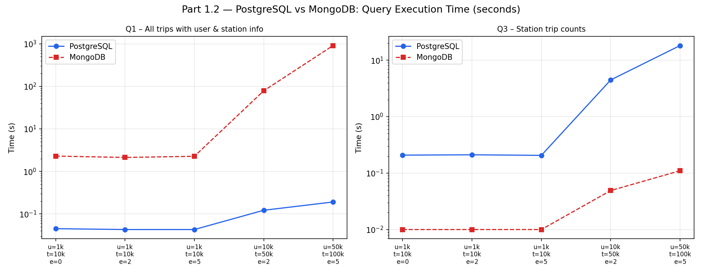
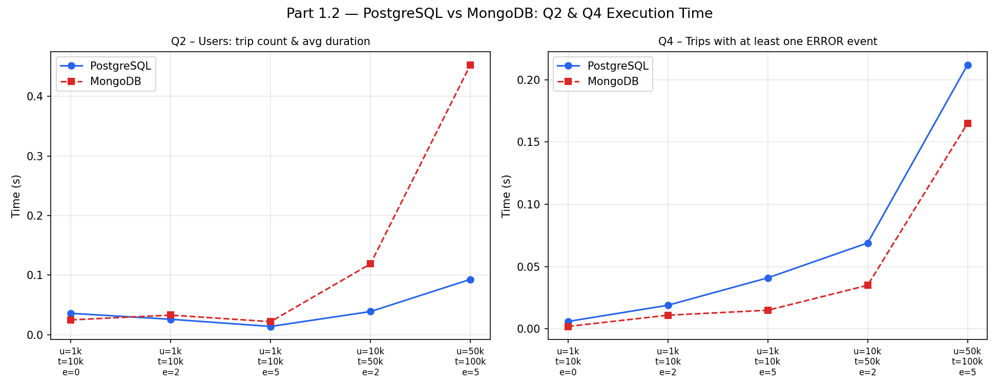
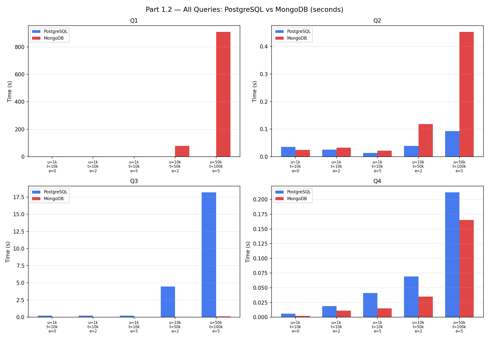
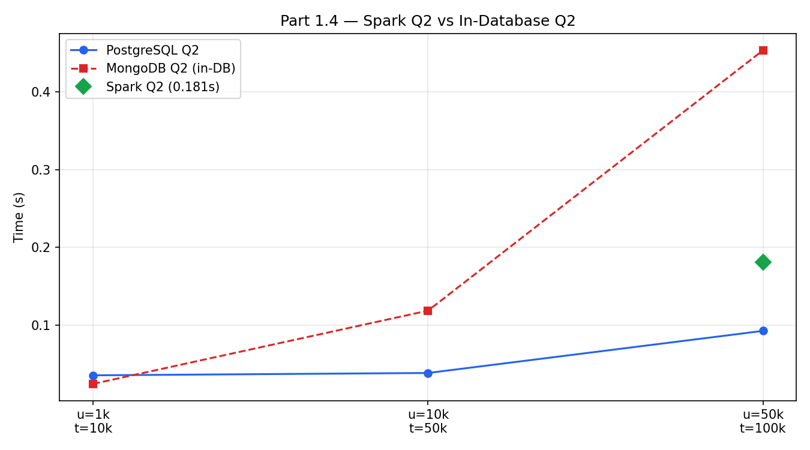
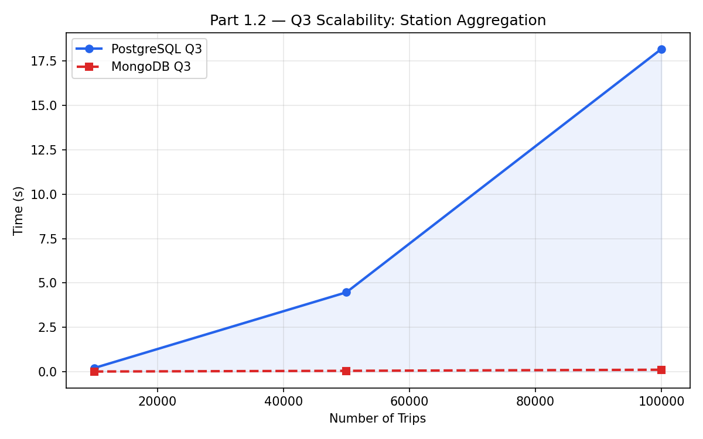
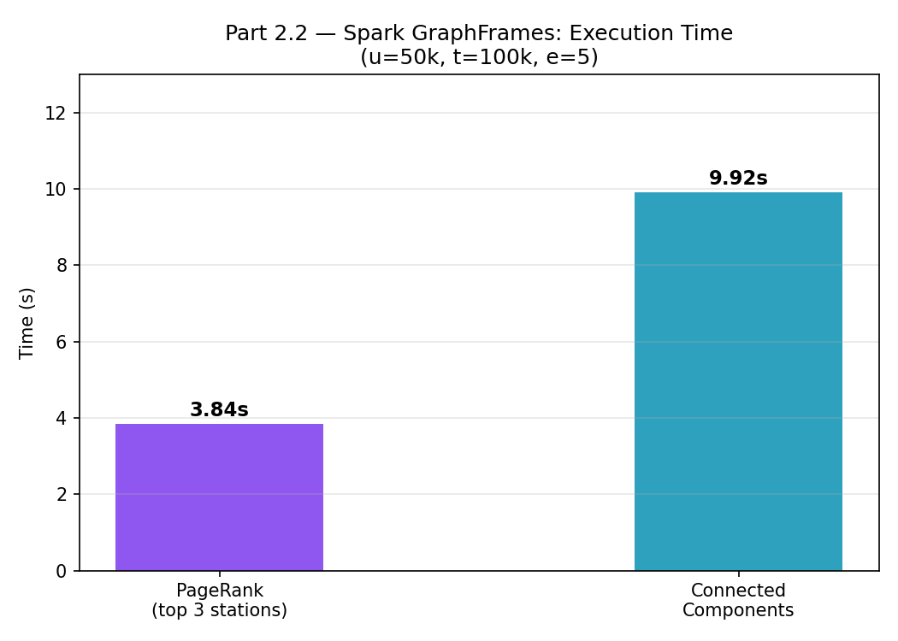

# Advanced Data Management — Project Report (2025/2026)

**Student:** Azizbek Gulomov  
**Course:** Advanced Data Management  
**Instructor:** Prof. Andrea Campagner  

**Technologies:** PostgreSQL · MongoDB · Neo4j · Apache Spark (PySpark, GraphFrames)  

**Repository:** [ADM-project-2025-26](https://github.com/AzizbekGulomov2002/ADM-project-2025-26.git)

This report follows the assignment structure in `Project_ADM_2025_2026.pdf` (Part 1: relational vs document; Part 2: graph; partitioning/replication). Each subsection uses the same narrative pattern as the sample technical report style: **Core logic → Key steps → Key code → Explanation → Output**, then **Results**, **Performance comparison** (per database), **Performance bottlenecks**, **Figures**, and **Conclusion**.

---

## Data domain and benchmark configurations

The project models a **city mobility** platform: **users**, **stations**, **trips**, and **events** (`GPS`, `ERROR`, `BATTERY`, `DELAY`).

Simulated data is generated by `data/generate_data.py` and loaded into PostgreSQL and MongoDB; the benchmark driver is `part1/benchmark.py`.

**Configurations used (assignment-aligned):**

| Users | Trips | Events per trip (avg) |
|------:|------:|----------------------:|
| 1k    | 10k   | 0, 2, 5               |
| 10k   | 50k   | 2                     |
| 50k   | 100k  | 5                     |

**Stations:** 50 (fixed in the generator for all runs below).

---

# Part 1 — Relational vs document models

## 1.1 Data modeling (assignment §2.1.1)

### PostgreSQL — normalized relational schema

**Files:** `part1/setup_postgres.py`

**Core logic**  
Model **users**, **stations**, **trips**, and **events** as separate tables. **Referencing** is used everywhere: `trips` reference `users` and `stations`; `events` reference `trips`.

**Key steps**

1. `DROP` / `CREATE` tables with foreign keys.  
2. Create indexes on trip and event access paths (`user_id`, station ids, `trip_id`, `type`).  
3. Bulk load from CSV (`users`, `stations`, `trips`, `events`).

**Key code (idea)**

```sql
-- Events live in their own table (referencing)
CREATE TABLE events (
  id INTEGER PRIMARY KEY,
  trip_id INTEGER REFERENCES trips(id),
  ...
);
```

**Explanation**  
This is the standard **normalized** design: no duplicated events, strong integrity, straightforward SQL. Querying trips together with events usually requires **JOINs**.

**Output**  
After load: row counts match CSV sizes; schema is ready for Part 1.2 queries.

---

### MongoDB — document schema with selective embedding

**Files:** `part1/setup_mongodb.py`

**Core logic**  
Collections: **`users`**, **`stations`**, **`trips`**. **Events are embedded** inside each trip document as an array. Users and stations stay **referenced by id** on trips to avoid massive duplication.

**Key steps**

1. Drop/reload collections.  
2. Insert users and stations as documents.  
3. Build trips with an `events: [...]` array from `events.csv`.  
4. Create indexes on `user_id`, station ids, and `events.type`.

**Key code (idea)**

```javascript
// Trip document shape (conceptual)
{ id, user_id, start_station_id, end_station_id, start_time, end_time, cost,
  events: [ { type, timestamp, value }, ... ] }
```

**Explanation**  
**Embedding** matches the assignment discussion: events always belong to one trip and are queried in that context (especially Q4). Referencing users/stations avoids duplicating stable master data.

**Output**  
Collections populated; Q4 can use a simple predicate on `events.type` without joining a separate events collection.

---

### Design comparison (referencing vs embedding)

| Aspect | PostgreSQL | MongoDB |
|--------|------------|---------|
| Events | Separate table + FK | Embedded in `trips` |
| Q4 (ERROR trips) | JOIN `events` | Filter on embedded array |
| Q1 (trip + names) | Native JOINs | Multiple `$lookup` stages |
| Consistency | ACID constraints | Application-level discipline |
| Evolution (optional fields) | DDL / migrations | Add fields to subset of docs |

---

## 1.2 Query implementation (assignment §2.1.2)

**Scripts:** `part1/queries_postgres.py`, `part1/queries_mongodb.py`  
**Benchmark:** `part1/benchmark.py`

Below, **Output** describes the *logical* result shape (one row per required entity / join result). Timings are in **seconds** from the benchmark run you recorded.

---

### Query 1 — All trips with user fields and start/end station names

#### PostgreSQL

**Core logic**  
Join `trips` to `users` and to **two** copies of `stations` (start and end).

**Key steps**

1. Open connection; run one `SELECT` with three joins.  
2. Fetch all rows.

**Key code**

```12:20:part1/queries_postgres.py
        cur.execute("""
            SELECT t.id, u.name, u.surname, u.country,
                   s1.name AS start_station, s2.name AS end_station,
                   t.start_time, t.end_time, t.cost
            FROM trips t
            JOIN users    u  ON t.user_id          = u.id
            JOIN stations s1 ON t.start_station_id = s1.id
            JOIN stations s2 ON t.end_station_id   = s2.id
        """)
```

**Explanation**  
Indexed foreign keys keep this pattern efficient on a single node; cost grows mainly with **number of trips**.

**Output**  
One row per trip: trip id, user identity fields, start/end station **names**, times, cost.

#### MongoDB

**Core logic**  
Aggregation pipeline: three **`$lookup`** stages (user + two station collections), then unwind and project.

**Key steps**

1. `$lookup` users, `$lookup` stations twice.  
2. `$unwind` joined arrays; `$project` flat fields.

**Key code**

```9:17:part1/queries_mongodb.py
    return list(db.trips.aggregate([
        {"$lookup":{"from":"users",    "localField":"user_id",          "foreignField":"id","as":"user"}},
        {"$lookup":{"from":"stations", "localField":"start_station_id", "foreignField":"id","as":"s_st"}},
        {"$lookup":{"from":"stations", "localField":"end_station_id",   "foreignField":"id","as":"e_st"}},
        {"$unwind":"$user"}, {"$unwind":"$s_st"}, {"$unwind":"$e_st"},
        {"$project":{"_id":0,"id":1,"user.name":1,"user.surname":1,
                     "start_station":"$s_st.name","end_station":"$e_st.name",
                     "start_time":1,"end_time":1,"cost":1}}
    ]))
```

**Explanation**  
This is the document equivalent of three joins. At large scale, **`$lookup`** dominates runtime because it is a cross-collection join implemented inside the aggregation engine.

**Output**  
Same information as PostgreSQL Q1, as JSON-like documents.

---

### Query 2 — All users: trip count and average trip duration

#### PostgreSQL

**Core logic**  
`LEFT JOIN` users to trips, `GROUP BY` user, compute `COUNT` and average duration in minutes via `EXTRACT(EPOCH FROM …)`.

**Key steps**

1. Aggregate in SQL.  
2. Return one row per user (including users with zero trips).

**Key code**

```27:34:part1/queries_postgres.py
        cur.execute("""
            SELECT u.id, u.name, u.surname,
                   COUNT(t.id) AS trip_count,
                   COALESCE(AVG(EXTRACT(EPOCH FROM (t.end_time - t.start_time))/60), 0) AS avg_min
            FROM users u
            LEFT JOIN trips t ON u.id = t.user_id
            GROUP BY u.id, u.name, u.surname
        """)
```

**Explanation**  
Pure relational aggregation; indexes on `trips.user_id` help.

**Output**  
Per user: `trip_count`, `avg_min` (minutes).

#### MongoDB

**Core logic**  
Aggregate trips: compute duration in pipeline, `$group` by `user_id`; merge with a full scan of `users` in Python.

**Key steps**

1. `$addFields` + `$group` on trips.  
2. Build a map `_id → stats`; iterate `users` to include zero-trip users.

**Key code**

```21:30:part1/queries_mongodb.py
    agg = {r["_id"]: r for r in db.trips.aggregate([
        {"$addFields":{"dur":{"$subtract":[{"$toDate":"$end_time"},{"$toDate":"$start_time"}]}}},
        {"$group":{"_id":"$user_id","trip_count":{"$sum":1},"avg_ms":{"$avg":"$dur"}}}
    ])}
    result = []
    for u in db.users.find({},{"_id":0}):
        a = agg.get(u["id"], {})
        result.append({**u, "trip_count": a.get("trip_count",0),
                       "avg_duration_min": round(a.get("avg_ms",0)/60000, 2)})
```

**Explanation**  
No `$lookup` here; performance is usually **similar order** to PostgreSQL for this workload.

**Output**  
Per user document with trip statistics.

---

### Query 3 — All stations: trips starting vs ending there

#### PostgreSQL

**Core logic**  
Two `LEFT JOIN`s from `stations` to `trips` (as start and as end), two `COUNT`s, `GROUP BY` station.

**Key steps**

1. Join trips twice.  
2. Group by station id.

**Key code**

```41:48:part1/queries_postgres.py
        cur.execute("""
            SELECT s.id, s.name, s.city,
                   COUNT(t1.id) AS trips_starting,
                   COUNT(t2.id) AS trips_ending
            FROM stations s
            LEFT JOIN trips t1 ON s.id = t1.start_station_id
            LEFT JOIN trips t2 ON s.id = t2.end_station_id
            GROUP BY s.id, s.name, s.city
        """)
```

**Explanation**  
Each station touches the **large trips table twice**. At 50k–100k trips this becomes the main **PostgreSQL** hotspot unless further optimized (e.g. pre-aggregation, covering indexes, or materialized views).

**Output**  
Per station: `trips_starting`, `trips_ending`.

#### MongoDB

**Core logic**  
Two separate `$group` pipelines on `trips` (by `start_station_id` and `end_station_id`), then merge in Python with `stations`.

**Key steps**

1. Count starts into a dict.  
2. Count ends into a dict.  
3. Merge with station list.

**Key code**

```34:38:part1/queries_mongodb.py
    starts = {r["_id"]:r["c"] for r in db.trips.aggregate([{"$group":{"_id":"$start_station_id","c":{"$sum":1}}}])}
    ends   = {r["_id"]:r["c"] for r in db.trips.aggregate([{"$group":{"_id":"$end_station_id",  "c":{"$sum":1}}}])}
    return [{"id":s["id"],"name":s["name"],"city":s["city"],
             "trips_starting":starts.get(s["id"],0),"trips_ending":ends.get(s["id"],0)}
            for s in db.stations.find({},{"_id":0})]
```

**Explanation**  
No cross-collection join for counts—only scans/groups on **trips** and a small **stations** collection. This is typically **much faster** than PostgreSQL Q3 at large trip counts.

**Output**  
Per station: start count, end count.

---

### Query 4 — Trips with at least one `ERROR` event

#### PostgreSQL

**Core logic**  
Join `trips` to `events`, filter `type = 'ERROR'`, `DISTINCT` trips.

**Key steps**

1. Join on `trip_id`.  
2. Filter and deduplicate.

**Key code**

```56:60:part1/queries_postgres.py
        cur.execute("""
            SELECT DISTINCT t.id, t.user_id, t.start_time, t.end_time, t.cost
            FROM trips t
            JOIN events e ON t.id = e.trip_id
            WHERE e.type = 'ERROR'
        """)
```

**Explanation**  
Cost grows with **number of events** and index use on `(trip_id, type)`.

**Output**  
One row per distinct trip that has at least one ERROR event.

#### MongoDB

**Core logic**  
Query trips where embedded `events` array contains `type: ERROR`.

**Key steps**

1. `find` with `{"events.type": "ERROR"}`.

**Key code**

```41:44:part1/queries_mongodb.py
    return list(db.trips.find({"events.type":"ERROR"},
                               {"_id":0,"id":1,"user_id":1,"start_time":1,"end_time":1,"cost":1}))
```

**Explanation**  
This is the payoff of **embedding**: no events collection join.

**Output**  
Trip documents (projected fields) for all ERROR trips.

---

## Results — Part 1 benchmark (`python part1/benchmark.py`)

Times are **seconds** (wall clock per query, as printed by the benchmark script).

| Config (u, t, e) | PG-Q1 | PG-Q2 | PG-Q3 | PG-Q4 | MG-Q1 | MG-Q2 | MG-Q3 | MG-Q4 |
|------------------|------:|------:|------:|------:|------:|------:|------:|------:|
| u=1000, t=10000, e=0 | 0.045 | 0.036 | 0.208 | 0.006 | 2.289 | 0.025 | 0.010 | 0.002 |
| u=1000, t=10000, e=2 | 0.043 | 0.026 | 0.211 | 0.019 | 2.128 | 0.033 | 0.010 | 0.011 |
| u=1000, t=10000, e=5 | 0.043 | 0.014 | 0.206 | 0.041 | 2.264 | 0.022 | 0.010 | 0.015 |
| u=10000, t=50000, e=2 | 0.122 | 0.039 | 4.470 | 0.069 | 78.518 | 0.119 | 0.049 | 0.035 |
| u=50000, t=100000, e=5 | 0.191 | 0.093 | 18.180 | 0.212 | 908.626 | 0.453 | 0.110 | 0.165 |

---

## Performance comparison report — PostgreSQL (Part 1.2)

**Core logic**  
Single-node PostgreSQL executes declarative SQL with B-tree indexes on foreign keys and filter columns.

**Key observations**

- **Q1, Q2, Q4** stay comparatively **stable** as data grows; at the largest config they remain on the order of **tenths of a second** for Q1/Q2/Q4.  
- **Q3** is the **outlier**: **~18.18 s** at `u=50k, t=100k` because of **two large joins** from `stations` into `trips`.

**Performance bottlenecks (PostgreSQL)**

| Query | Bottleneck |
|-------|------------|
| Q3 | Double join + aggregation over full `trips` twice |
| Q4 | Grows with event volume (join + distinct), mitigated by indexes |

**Mitigations (conceptual)**  
Materialized rollups for station traffic; partial/covering indexes; or denormalized counters if this query is SLA-critical.

---

## Performance comparison report — MongoDB (Part 1.2)

**Core logic**  
Aggregation and finds run on BSON documents; Q1 uses **`$lookup`** cross-collection joins.

**Key observations**

- **Q1** degrades sharply at scale (**~908.6 s** at `u=50k, t=100k`): **`$lookup`** is the dominant cost.  
- **Q2** stays efficient via **`$group`** on trips only.  
- **Q3** stays **fast** (~**0.11 s** max here): two grouped passes, no expensive join across large collections for the counts.  
- **Q4** stays **fast** (~**0.17 s** max): embedded events → simple predicate.

**Performance bottlenecks (MongoDB)**

| Query | Bottleneck |
|-------|------------|
| Q1 | Multiple `$lookup` stages (document “join” cost) |
| Q2 | Minor: Python merge over all users after aggregation |

---

## Figures — Part 1 performance (placeholders)

Insert the generated charts here (paths relative to this file):











---

## 1.3 Schema evolution — `BATTERY` + `battery_level` (assignment §2.1.3)

**Requirement**  
All **`BATTERY`** events must support an extra integer **`battery_level`** in `[0, 100]`.

**PostgreSQL — Core logic**  
Add a nullable column (or constrained column) on **`events`**; enforce “only BATTERY rows must have level” with a `CHECK` constraint; backfill old rows in a controlled migration.

**Key steps**  
`ALTER TABLE` → optional backfill → tighten constraint / NOT NULL for BATTERY only (multi-step in production).

**Explanation**  
DDL touches **all** event rows; non-BATTERY rows may carry NULL/wasted column; migrations often need a maintenance window.

**MongoDB — Core logic**  
Add `battery_level` only on new or updated BATTERY subdocuments in the embedded array; old documents remain valid.

**Explanation**  
**Schema-on-read** fits optional per-type fields without rewriting the whole collection.

**Conclusion (evolvability)**  
For this specific change, **MongoDB is more flexible** with the chosen embedded-events design.

---

## 1.4 Spark-based implementation — Query 2 (assignment §2.1.4)

**File:** `part1/spark_query2.py`

**Core logic**  
Read `users.csv` and `trips.csv` as DataFrames; compute duration in minutes; `groupBy(user_id)`; **left join** users so users with zero trips appear.

**Key steps**

1. `SparkSession` local.  
2. `withColumn` duration from `unix_timestamp`.  
3. `groupBy` + `agg`; join to users.  
4. `count()` action to measure time.

**Key code**

```11:23:part1/spark_query2.py
users = spark.read.csv("data/users.csv", header=True, inferSchema=True)
trips = spark.read.csv("data/trips.csv", header=True, inferSchema=True)

trips2 = trips.withColumn("dur_min",
    (F.unix_timestamp("end_time") - F.unix_timestamp("start_time")) / 60)

agg = trips2.groupBy("user_id").agg(
    F.count("id").alias("trip_count"),
    F.round(F.avg("dur_min"), 2).alias("avg_duration_min")
)

result = users.join(agg, users.id == agg.user_id, "left").drop("user_id")
```

**Results (from project PDF / extended report, max config `u=50k, t=100k, e=5`)**  

| Method | Time | Note |
|--------|-----:|------|
| PostgreSQL Q2 | ~0.093 s | Native aggregation |
| Spark Q2 | ~0.181 s | Local Spark: JVM + scheduling overhead |
| MongoDB Q2 | ~0.453 s | Pipeline + Python merge |

**Explanation**  
On a laptop, Spark often loses to a tuned RDBMS for data that fits one node. Spark’s advantage is **horizontal scale** and running the same logic on files or a cluster without DB setup.

**Output**  
DataFrame of users with `trip_count` and `avg_duration_min`; sample rows via `show()`.

---

# Part 2 — Graph model (assignment §2.2)

## 2.1 Neo4j — schema and queries (assignment §2.2.1)

**Files:** `part2/setup_neo4j.py`, `part2/queries_neo4j.py`

**Core logic**  
Nodes: **`USER`**, **`TRIP`**, **`STATION`**. Relationships: **`PERFORMED`**, **`STARTS_AT`**, **`ENDS_AT`**, matching the assignment’s graph shape.

**Key steps**

1. Clear graph.  
2. `MERGE` nodes from CSV.  
3. `MERGE` relationships from trip rows.

**Query 1 — Stations reachable by a user**

**Core logic**  
From `USER` → `PERFORMED` → `TRIP` → (`STARTS_AT`|`ENDS_AT`) → `STATION`; `DISTINCT` stations.

**Explanation**  
Short, explicit traversals are what graph stores optimize for (pointer-like hops vs repeated relational joins).

**Output**  
Distinct stations (id, name, city) connected to the user’s trips.

**Query 2 — Top 3 “important” stations by trip connectivity**

**Core logic**  
Count trips linked to each station via start/end edges; order descending; limit 3.

**Explanation**  
Linear in number of trip–station edges; aligns with “incoming + outgoing” trip-based importance in the brief.

**Output**  
Three stations with highest total trip counts.

---

## 2.2 Spark GraphFrames (assignment §2.2.2)

**File:** `part2/spark_graphframes.py`

**Core logic**  
Vertices = stations; edges = directed links `start_station_id → end_station_id` from each trip. Run **PageRank** and **Connected components**.

**Key steps**

1. Build `GraphFrame`.  
2. PageRank (`resetProbability=0.15`, small `maxIter`).  
3. Set checkpoint dir; run connected components; group by component.

**Results (from extended project report timings)**  

| Task | Approx. time | Note |
|------|-------------:|------|
| PageRank (top 3) | ~3.84 s | Few iterations on small vertex set |
| Connected components | ~9.92 s | Iterative + checkpoint I/O |

**Sample PageRank output (from report PDF)**  
Top stations included high-rank nodes in cities such as Florence and Rome in the simulated dataset (see PDF table).

**Connected components output**  
All **50** stations fell into **one** component in that run (fully connected station subgraph under generated trip edges).

**Figure — GraphFrames timings**



---

# Part 3 — Partitioning and replication (assignment §2.3)

## 3.1 Partitioning (`trips` by user vs by start station)

**Core logic**  
Sharding co-locates related trips to reduce cross-shard work for some queries at the expense of others.

**Key comparison (summary)**  

- **Partition by `user_id`:** helps **user-centric** workloads (Q2, user-filtered Q1, Neo4j Q1-style access patterns); hurts **station-global** aggregations (Q3, Neo4j Q2) due to scatter/gather.  
- **Partition by `start_station_id`:** helps **starts-per-station**; **ends** and **user-wide** trip lists still scatter.

**Conclusion**  
A practical default for this brief is often **`user_id` hashing** if the product is user-centric, accepting that global station dashboards pay extra aggregation cost—or use auxiliary pre-aggregates.

## 3.2 Replication (single-leader async, read from secondaries)

**Core logic**  
Secondaries can **lag** the primary; reads may be **stale**.

**Query-level impact (short)**  

- **Q1 / Q2 / Q3:** mostly **analytics staleness** (counts/lists slightly behind).  
- **Q4 (ERROR) and safety-style graph reads:** **higher risk** if served from lagging replicas—missed fresh errors.  
- **Recommendation:** route **critical** reads to **primary**; use secondaries for tolerant analytics.

---

# Conclusion

1. **PostgreSQL** delivers strong, predictable performance for **join-heavy** trip reporting (**Q1**, **Q2**) and remains acceptable on **Q4** at tested scales; **Q3** is the main relational hotspot due to **double trip joins**.  
2. **MongoDB** is weakest on **Q1** at large scale because of **`$lookup`**, but strongest on **Q4** thanks to **embedded events**, and very competitive on **Q3** via **two lightweight group passes**.  
3. **Neo4j** matches the assignment graph model and is the natural place for **reachability** and **trip-centric station importance** as graph traversals.  
4. **Spark** complements the stack for **large-scale** or **file-based** pipelines (**Q2** DataFrame; **GraphFrames** analytics), with local-mode overhead versus DB engines on small data.  
5. **Operational design** (partitioning + async replicas) trades **freshness** vs **cost**; **ERROR** detection should not rely on stale secondaries.

---

*End of report.*
